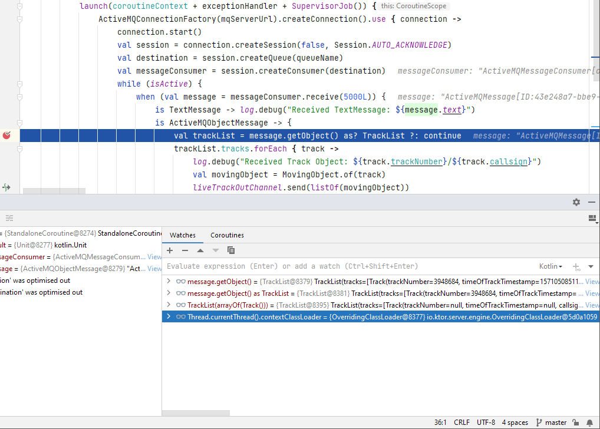
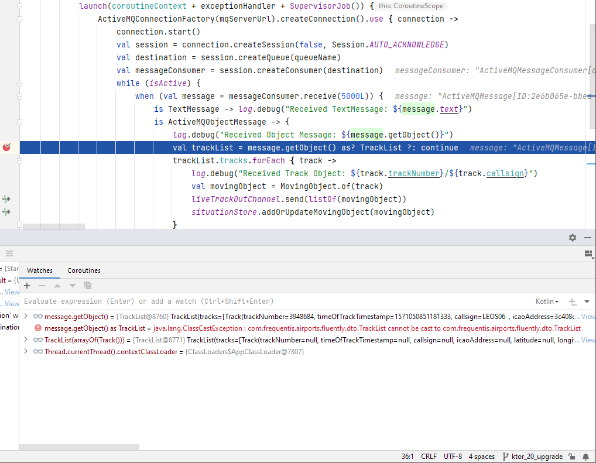

# [KTOR-4164: Different ClassLoader behaviour in Ktor-2.0.0 (vs. Ktor-1.6.x) produces a ClassCastException within a CouroutineScope](https://youtrack.jetbrains.com/issue/KTOR-4164)

In a CoroutineScope of a Ktor-2.0.0-application (netty-engine), the "ClassLoaders@AppClassLoader" is not aware of Objects loaded by the (default?) Application ClassLoader. Therefore, for exampe, received objects from an (Apache-ActiveMQ-Artemis-)message-queue cannot be cast to its corresponding DTOs - see attached screenshots with Ktor-1.6.8/Kotlin-1.6.10 vs. Ktor-2.0.0/Kotlin-1.6.20.

 

# To reproduce the error:

1) get and start the Apache ActiveMQ Artemis - message broker:

<pre><code>
wget https://downloads.apache.org/activemq/activemq-artemis/2.22.0/apache-artemis-2.22.0-bin.tar.gz

tar xfz apache-artemis-2.22.0-bin.tar.gz

apache-artemis-2.22.0/bin/artemis create ktor-test # username: test / password: test / anonymous access: Y

ktor-test/bin/artemis run
</code></pre>

2) either run the `com.example.ApplicationTest` or run the Ktor-application in "development"-mode (`-Dio.ktor.development=true`) and start the `com.example.MessageProducer` afterwards.
**FYI: Everything works fine in "normal"-mode (`-Dio.ktor.development=false`) and the class cast exception doesn't occur!**

<pre><code>
2022-05-09 13:14:23.841 [DefaultDispatcher-worker-1] INFO  ktor.application - Received Test object as JSON message: Test(id=1)
Exception in thread "DefaultDispatcher-worker-1" java.lang.ClassCastException: class com.example.dto.Test cannot be cast to class com.example.dto.Test (com.example.dto.Test is in unnamed module of loader 'app'; com.example.dto.Test is in unnamed module of loader io.ktor.server.engine.OverridingClassLoader$ChildURLClassLoader @1c7696c6)
	at com.example.plugins.MessageQueueKt$configureMessageQueue$1.invokeSuspend(MessageQueue.kt:39)
	at kotlin.coroutines.jvm.internal.BaseContinuationImpl.resumeWith(ContinuationImpl.kt:33)
	at kotlinx.coroutines.DispatchedTask.run(DispatchedTask.kt:106)
	at kotlinx.coroutines.scheduling.CoroutineScheduler.runSafely(CoroutineScheduler.kt:570)
	at kotlinx.coroutines.scheduling.CoroutineScheduler$Worker.executeTask(CoroutineScheduler.kt:749)
	at kotlinx.coroutines.scheduling.CoroutineScheduler$Worker.runWorker(CoroutineScheduler.kt:677)
	at kotlinx.coroutines.scheduling.CoroutineScheduler$Worker.run(CoroutineScheduler.kt:664)
	Suppressed: kotlinx.coroutines.DiagnosticCoroutineContextException: [StandaloneCoroutine{Cancelling}@561bd503, Dispatchers.Default]
</code></pre>
